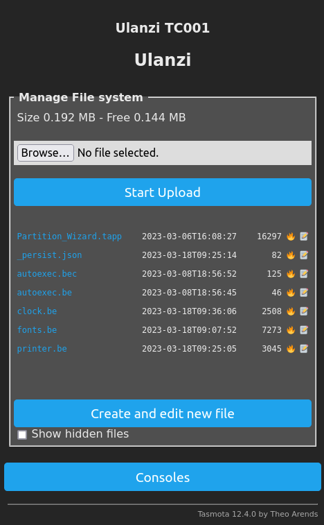

# Ulanzi TC001


## Flash Tasmota firmware

### **Warning**: 
Flashing Tasmota firmware on your device may potentially brick or damage the device. It is important to proceed with caution and to understand the risks involved before attempting to flash the firmware. Please note that any modifications to the device's firmware may void the manufacturer's warranty and may result in permanent damage to the device. It is strongly recommended to thoroughly research the flashing process and to follow instructions carefully. The user assumes all responsibility and risk associated with flashing the firmware.

To install Tasmota firmware on the Ulanzi TC001, follow these steps:

1. Download the Tasmota firmware from the [official Tasmota website](http://ota.tasmota.com/tasmota32/release/).
2. Follow installation guide [here](https://templates.blakadder.com/ulanzi_TC001.html).
3. In the Tasmota web interface, go to "Consoles" and select "Console". Enter the command "Pixels 256" to enable the 256-pixel display mode.
4. Set the time zone via the console by entering the command "Timezone +2:00".

**********************
## [Berry](https://tasmota.github.io/docs/Berry/) Rainbow

To set up a [rainbow](https://tasmota.github.io/docs/Berry_Addressable-LED/) effect on your Tasmota Berry device, follow these steps:
1. Go to "Consoles" in the Tasmota web interface and select "Berry Scripting Console".
2. Copy the code from [rainbow.be](rainbow.be) and paste it into the console.
3. Run the code to display the rainbow effect on the device.

To automatically start the rainbow effect when the device starts up:
1. Create a new file called [autoexec.be](https://tasmota.github.io/docs/UFS/#autoexecbe) in the root directory of the device's file system.
2. Copy the code from [rainbow.be](rainbow.be) to autoexec.be
3. Save file and restart the device


**********************
## Clock

To set up a clock on your Tasmota device, you need to follow these steps:

1. Go to the Tasmota web interface.
2. Click on "Consoles" and select "Manage File System".
3. Create a new file called `fonts.be` and add the contents from [fonts.be](fonts.be).
4. Create a new file called `clock.be` and add the contents from [clock.be](clock.be).
5. Create a new file called `autoexec.be` with the contents from [autoexec.be](autoexec.be). 


These files contain the necessary code to display a clock on the device. Once the files are created and saved, restart the device to apply the changes. The clock should now be visible on the device display.

## Buttons
```
def dimmer_over_50()
    print("The light is bright")
end
tasmota.add_rule("Button2#State", dimmer_over_50)
```

**********************
## Ideas
* Clock
* Sensors
* Poll some web data
* Print text in running line : News
* Alarm Clock
* Pixel Art
* Snake
**********************
## Links
* https://github.com/dhepper/font8x8
* https://github.com/Ameba8195/Arduino/blob/master/hardware_v2/cores/arduino/font5x7.h
* https://github.com/mikerr/codebug-arduino/blob/master/font4x5.h
* https://www.espruino.com/modules/Font4x4Numeric.js
* https://github.com/ninjablocks/arduino/blob/master/DMD/Font3x5.h