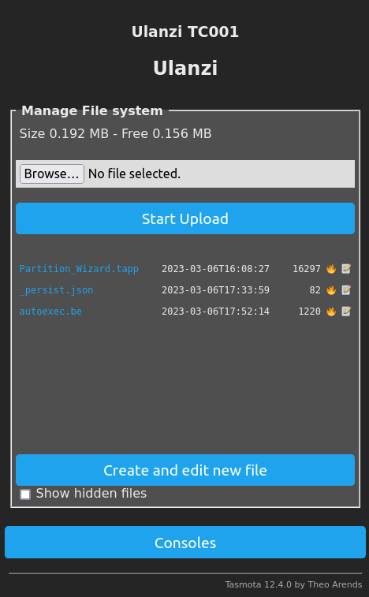

# Ulanzi TC001

## Flash Tasmota firmware

### **Warning**: 

Flashing Tasmota firmware on your device may potentially brick or damage the device. It is important to proceed with caution and to understand the risks involved before attempting to flash the firmware. Please note that any modifications to the device's firmware may void the manufacturer's warranty and may result in permanent damage to the device. It is strongly recommended to thoroughly research the flashing process and to follow instructions carefully. The user assumes all responsibility and risk associated with flashing the firmware.

* Follow guide [here](https://templates.blakadder.com/ulanzi_TC001.html)
    * Download firmware from [here](http://ota.tasmota.com/tasmota32/release/)
    * **FAILED !!!!** Do migration process to adapt the filesystem to Tasmota 
    * Go to Consoles -> Console, run : Pixels 256
    * Set time zone via console : Timezone +2:00

**********************
## [Berry](https://tasmota.github.io/docs/Berry/) Rainbow
* Following guide from [here](https://tasmota.github.io/docs/Berry_Addressable-LED/)
* Go to Consoles -> Berry Scripting console
* Copy code from [Rainbow.be](Rainbow.be) to console and run
* To [Auto start](https://tasmota.github.io/docs/UFS/#autoexecbe) rainbow

**********************
## Clock
* Copy [Clock.be](Clock.be) to [autoexec.be](https://tasmota.github.io/docs/UFS/#autoexecbe)
**********************
## Ideas
* Clock
* Sensors
* Poll some web data
* Print text in running line : News
* Alarm Clock
* Pixel Art
* Snake
**********************
## Links
* https://github.com/dhepper/font8x8
* https://github.com/Ameba8195/Arduino/blob/master/hardware_v2/cores/arduino/font5x7.h
* https://github.com/mikerr/codebug-arduino/blob/master/font4x5.h
* https://www.espruino.com/modules/Font4x4Numeric.js
* https://github.com/ninjablocks/arduino/blob/master/DMD/Font3x5.h